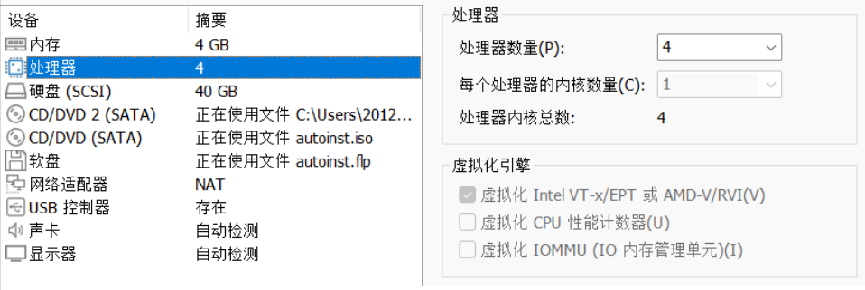
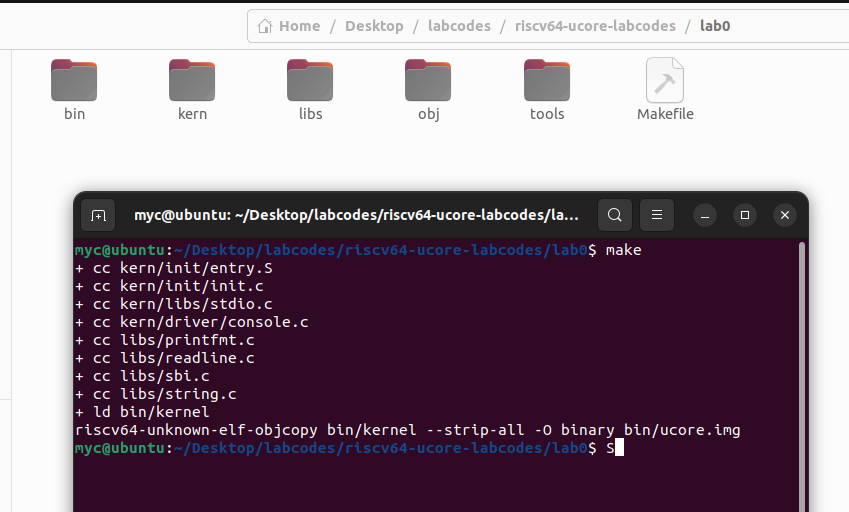
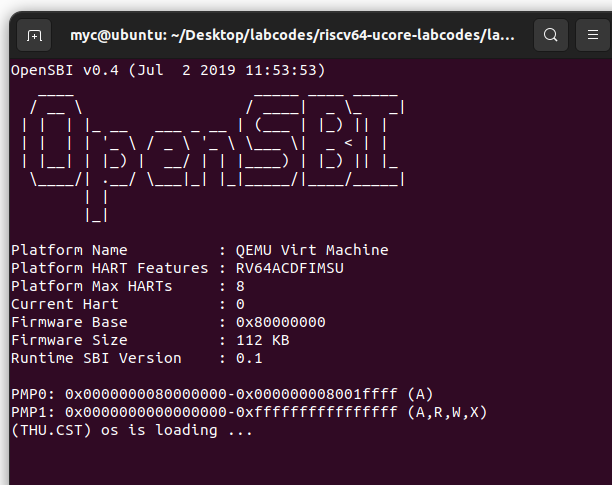
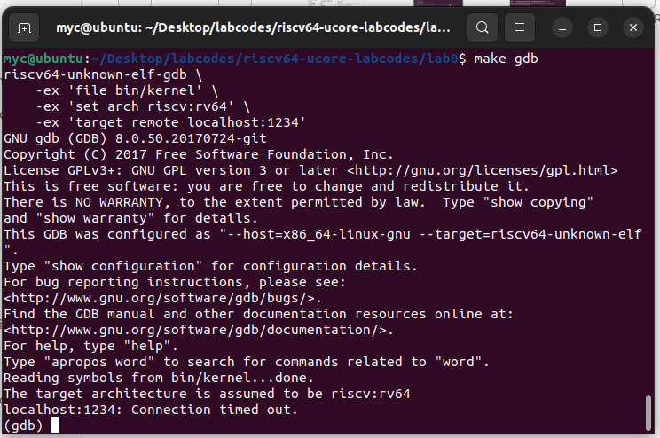

# First of All!

<video id="video" controls="" preload="none">
    <source id="mp4" src="./环境配置.mp4" type="video/mp4">
</video>


关于配置环境，我录了一个视频。我所使用的是UBUNTU22，具体设置如下

[6.828 ref](https://blog.csdn.net/zzzlueng/article/details/115277245)

```
sudo apt install libsdl1.2-dev
sudo apt install libtool-bin
sudo apt install libglib2.0-dev
sudo apt install libz-dev
sudo apt install libpixman-1-dev
```


# START
在上面的视频之中，可能有人发现了问题，下面这句话当你退出当前的shell之后会失效。因此你需要把这句话也设置为环境变量，比如写入.bashrc
```
export PATH=$PWD/riscv32-softmmu:$PWD/riscv64-softmmu:$PATH
```
START!
```
cd lab0
make
```


then

```
make qemu
```

The shell should looks like:


then , in another shell

```
make gdb
```

if :
```
riscv64-unknown-elf-gdb \
    -ex 'file bin/kernel' \
    -ex 'set arch riscv:rv64' \
    -ex 'target remote localhost:1234'
riscv64-unknown-elf-gdb: error while loading shared libraries: libncurses.so.5: cannot open shared object file: No such file or directory
make: *** [Makefile:177: gdb] Error 127

```

install it...

[ref](https://blog.csdn.net/qq_35078688/article/details/125326873)

if :

```
riscv64-unknown-elf-gdb \
    -ex 'file bin/kernel' \
    -ex 'set arch riscv:rv64' \
    -ex 'target remote localhost:1234'
riscv64-unknown-elf-gdb: error while loading shared libraries: libpython2.7.so.1.0: cannot open shared object file: No such file or directory
make: *** [Makefile:177: gdb] Error 127

```

install it...

[ref](https://stackoverflow.com/questions/26597527/how-to-install-libpython2-7-so)

then,make gdb again!



FINISHI!


## question
实验指导书里有这样两条命令
```
$qemu-system-riscv64 \
-machine virt \
-nographic \
-bios default \
-device loader,file=$(UCOREIMG),addr=0x80200000\
-s -S
```

```
riscv64-unknown-elf-gdb \
-ex 'file bin/kernel' \
-ex 'set arch riscv:rv64' \
-ex 'target remote localhost:1234'
```
直接运行为什么会报错？
```
UCOREIMG:未找到命令
```
### ANSWER:
1. 你没有执行make，这时候那个ucoreimg都没有，自然不会成功。先make，这时候在bin下面会有ucoreimg

2. make了，还是不行。很简单，$(UCOREIMG)是个变量，你在shell里运行，shell会找这个变量。

shell的变量会存在诸如：/etc/environment、.bashrc等地方，你在shell之中输入env可以看见所有shell能找到的变量。


可是shell里没这个东西啊，没人定义，自然就报错了

那么，实验指导书里这两个命令在哪呢？

在makefile里

[lab0-4.png](./lab0-4.png)

ucoreimg也在这里被定义了

[lab0-4.png](./lab0-4.png)

到此，解释了我们上面为什么运行make qemu和make gdb而不是实验指导书里那几个很长的命令的原因了
