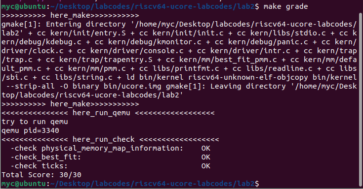

# lab2
The result should like :

Good Luck!

## buddy
**Notice: 必须有足够充足的测试样例，来体现buddy的各种情况。**

当年我写这个玩意儿的时候自己设计的样例（贼拉跨，仅供娱乐，不能供参考）:
```
首先申请 p0 p1 p2 p3
其大小为 70 35 257 63

从前向后分配的块以及其大小 |128(64+64)|64|64|256(128+128)|512|
其对应的页                |p0        |p1|p3|空          |p2 |

然后释放p1\p3

这时候p1和p3的块应该合并

再释放p0

这时候前512个页已经空了,需要展示合并后的结果

然后我们申请 p4 p5
其大小为     255 255

那么这时候系统的内存空间是这样的
|256|256|512|
|p4 |p5 |p2 | 

最后释放。
```

重点是展示各种分配和合并的状态。可以设计更加复杂的样例来充分体现

## slub

slub 在一定程度上是基于buddy的，那么，你需要说明你所实现的 slub (可以是某种程度的简化版本，指导书已经说明)是如何基于buddy的，包括但不限于关于如何分配2的幂大小的页。同时，你需要设计一个复杂的样例，来充分展示你所实现的 slub 算法的种种情况，以证明你的实现是正确的。

注意，挑战仅限学有余力的同学完成。同时，综合考虑性价比，也不需要完成所有挑战任务。当然，如果你对操作系统有着浓厚的兴趣，可以不断深入。

## challenge3
希望同学是在认真查阅资料之后得出结论，而不是为了拿到更高的分数而说一些似是而非的东西.

